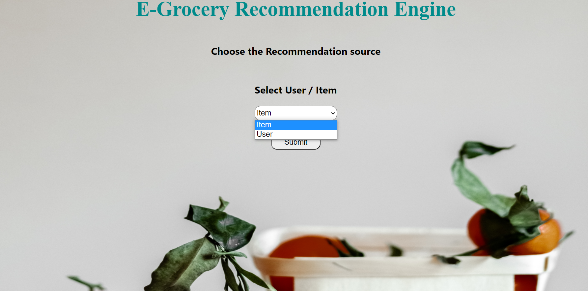
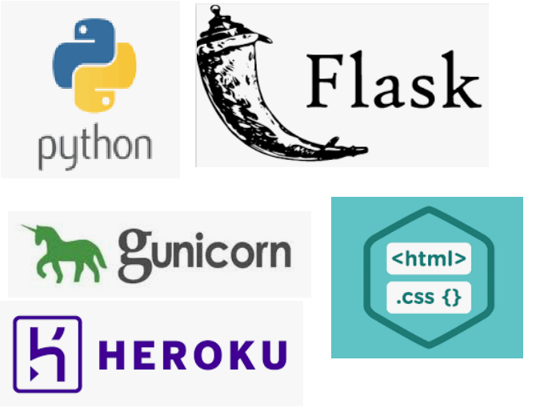

# herokudeployment
Recommendation Engine for E-Grocery store 

## Table Of Contents

* Demo
* Motivation
* Technical Aspect
* Goal
* Directory tree
* Technologies used
* credits 

## Demo

link : https://e-groceryrecommendationeng.herokuapp.com/

## Motivation
This Project is initiated to help e-grocery stores, owing to the increase in Online sales due to covid. Amazon and netflix recommendation systems are amazing and keeps us engaged
while shopping or browsing. This project is a small initiative to understand and reflect all the hardwork behind those.. ' Items you may like..', 'Movies recommended for you..'.!

## Technical Aspect
The Project is divided into different sections..
* EDA- cleaing the data and extracting the user-tem matrix
* visualizations - Tableau is used for visualizing the data and draw the insights
* Model building - Lot of traditional algorithms are tested but finally I'm stuck with Lightfm hybrid model owing to it's advantages.
* Flask - Flask app is developed with support of html and css.
* Deployment - The heroku platform is used to deploy the ML model

## Goal 
The Goal of the project is to engage customer on the app and increase the no. of conversions by giving the appropriate recommendations

## Technologies Used 

## credits 
[Google.com](https://www.google.com/)
[medium.com](https://medium.com/)

